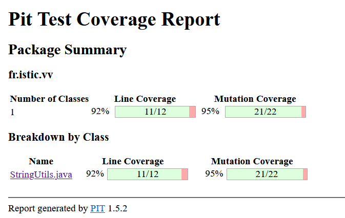

# Balanced strings

A string containing grouping symbols `{}[]()` is said to be balanced if every open symbol `{[(` has a matching closed symbol `)]}` and the substrings before, after and between each pair of symbols is also balanced. The empty string is considered as balanced.

For example: `{[][]}({})` is balanced, while `][`, `([)]`, `{`, `{(}{}` are not.

Implement the following method:

```java
public static boolean isBalanced(String str) {
    ...
}
```

`isBalanced` returns `true` if `str` is balanced according to the rules explained above. Otherwise, it returns `false`.

Use the coverage criteria studied in classes as follows:

1. Use input space partitioning to design an initial set of inputs. Explain below the characteristics and partition blocks you identified.
2. Evaluate the statement coverage of the test cases designed in the previous step. If needed, add new test cases to increase the coverage. Describe below what you did in this step.
3. If you have in your code any predicate that uses more than two boolean operators, check if the test cases written so far satisfy *Base Choice Coverage*. If needed, add new test cases. Describe below how you evaluated the logic coverage and the new test cases you added.
4. Use PIT to evaluate the test suite you have so far. Describe below the mutation score and the live mutants. Add new test cases or refactor the existing ones to achieve a high mutation score.

Write below the actions you took on each step and the results you obtained.
Use the project in [tp3-balanced-strings](../code/tp3-balanced-strings) to complete this exercise.

## Answer

### Question 1
Characteristics and Partition Blocks:
- Input Type: String
- Valid Input: Strings with balanced grouping symbols {}, [], ().
- Invalid Input: Strings with unbalanced or unexpected grouping symbols.
- Empty Input: An empty string.

### Question 2
Test case are written to use each boolean private method.
So the goal is to go in each sub-method.

However it's not enough because whe should check each boolean
in the statement.

### Question 3

We should test each statement of my private method as input
of the public method isBalanced

### Question 4



Over all the generated mutant, there is one mutant alive 
. Which It was returning True in the IsCloseSymbols instead
of the condition about close characters.

The final score is 95% for the balanced Strings


